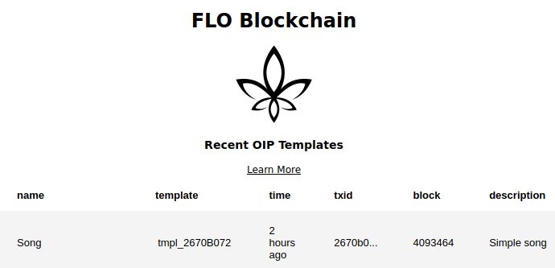

# oip-template-explorer


Explore OIP templates published to the FLO blockchain 

Live version at https://floblockchain.org/oip-template-explorer

## Install
Clone this repo and install using:
```
npm install
```

## Run

Modify `.env`: 
```
EXPRESS_PORT=3000
PAGINATION_LIMIT=11
```

Start the express server:
```
node index.js
```

## Reverse proxy
You can use a reverse proxy to serve this as a subdomain or subdirectory on the web. 

### Apache Reverse Proxy Example
```
ProxyPass /oip-template-explorer http://localhost:3000
ProxyPassReverse /oip-template-explorer http://localhost:3000
```

## TODO
* Search bar
* New template engine with async capabilities
* Count records for each template
* Cache
* Display more info per template in a dropdown
* Sidebar navigation
* Favorites
* Fix pagination
* Configuration for local OIP API
